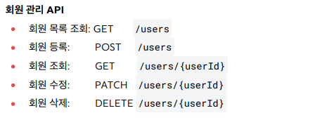

Spring MVC basic

1.0.1 Logging

로그레벨 설정은 application.properties에서 진행한다.

application.properties : logging.level.hello.springmvc=info
info로 설정하게되면 info레벨 이하는 모두 볼 수 있다.(info가 default)

1.0.2 Rest API

Rest API의 기본틀